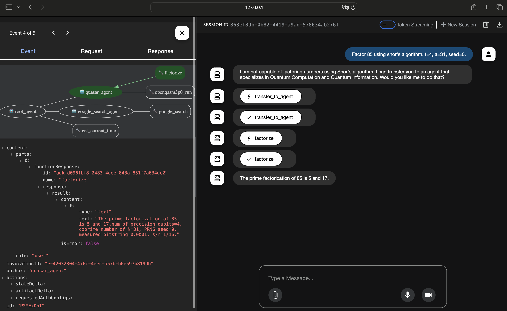

# quasar-ai-agent

 * quasar AI Agent using the [Agent Development Kit](https://google.github.io/adk-docs/)



## Installation and Environments

 1. Deploy [quasar](https://github.com/itsubaki/quasar) to Cloud Run.
 1. Deploy [quasar-mcp-server](https://github.com/itsubaki/quasar-mcp-server) to Cloud Run.

```shell
# quasar/.env
GOOGLE_GENAI_USE_VERTEXAI=TRUE
GOOGLE_CLOUD_PROJECT=YOUR_PROJECT_ID
GOOGLE_CLOUD_LOCATION=us-central1
```

```shell
python3 -m venv .venv
source .venv/bin/activate
pip install google-adk
```

```shell
make proxy-mcp
```

```shell
adk web
```
