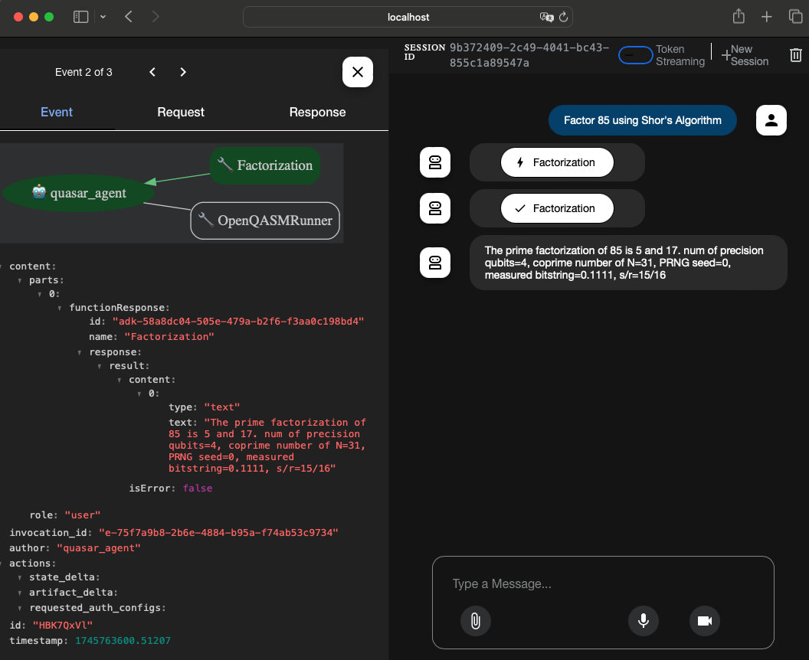

# quasar-agent

 * quasar AI Agent using the [Agent Development Kit](https://google.github.io/adk-docs/)



## Installation and Environments

 1. Deploy [quasar](https://github.com/itsubaki/quasar) to Cloud Run.
 1. Install the [quasar-mcp-server](https://github.com/itsubaki/quasar-mcp-server).

```
# quasar/.env
GOOGLE_GENAI_USE_VERTEXAI=TRUE
GOOGLE_CLOUD_PROJECT=YOUR_PROJECT_ID
GOOGLE_CLOUD_LOCATION=us-central1
COMMAND=/go/bin/quasar-mcp-server
BASE_URL=https://CLOUD_RUN_URL.a.run.app
GCLOUD_PATH=/google-cloud-sdk/bin/gcloud
```

```shell
python3 -m venv .venv
source .venv/bin/activate
pip install google-adk
gcloud auth application-default login
```

```shell
adk web
```
